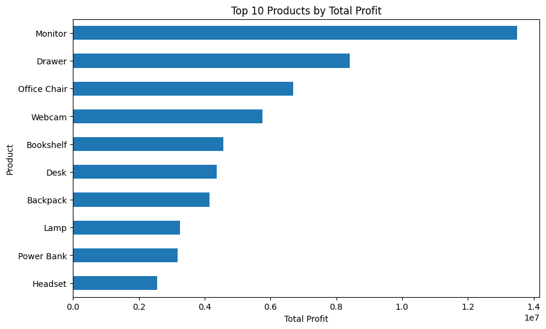
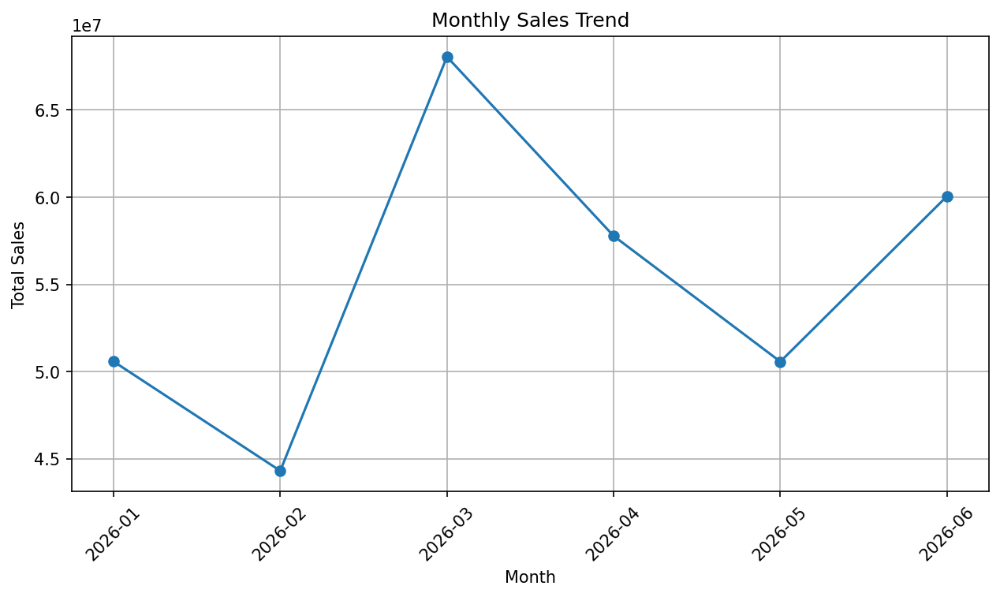
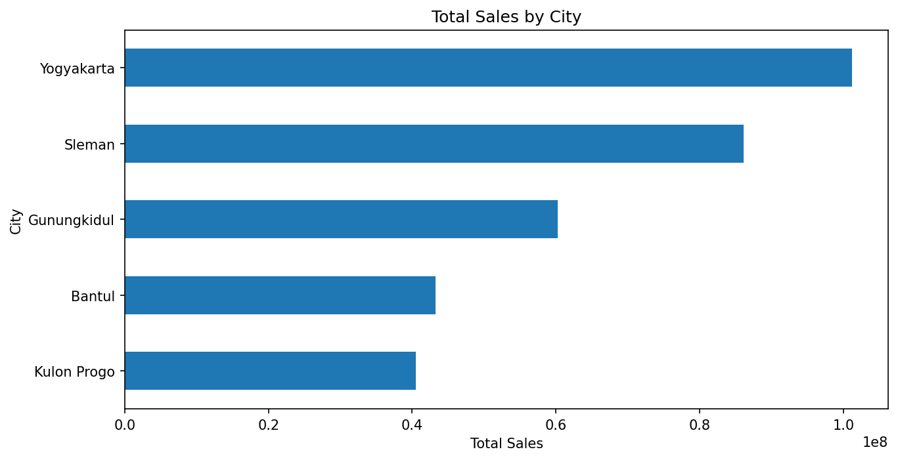
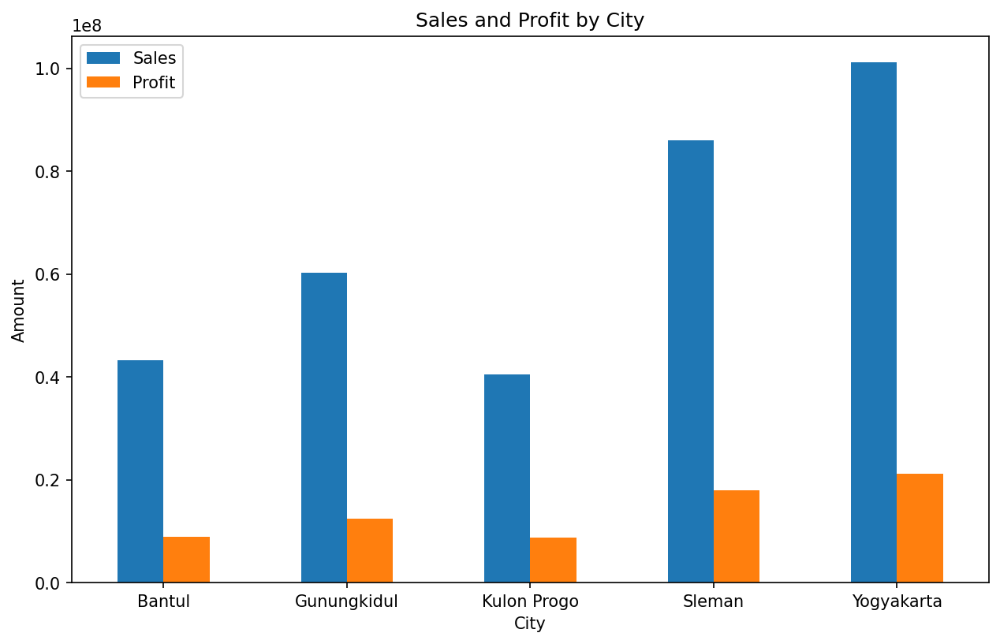
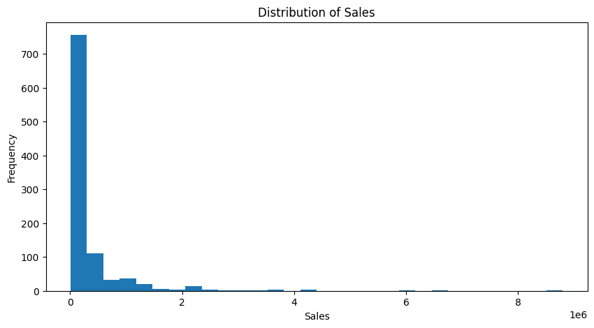

# Retail Sales Analysis

Exploratory Data Analysis (EDA) of retail sales transactions using Python, Pandas, and Matplotlib.

## Project Overview

This project analyzes retail sales transaction data to understand sales performance, profitability, product performance, monthly sales trends, and sales distribution across cities.

The analysis was performed using Python in Google Colab, with data preparation and cleaning supported by MySQL/phpMyAdmin.

## Objectives

The main objectives of this project are:

- Understand overall retail sales performance.
- Analyze sales and profit by product category.
- Identify products with the highest total profit.
- Analyze monthly sales trends.
- Compare sales and profit across cities.
- Calculate profit margins by city.
- Generate visualizations to support business insights.

## Dataset

The dataset contains **1,000 retail sales transactions**.

The main columns used in the analysis are:

| Column | Description |
|---|---|
| Order_ID | Unique transaction identifier |
| Order_Date | Date of the transaction |
| Customer_ID | Customer identifier |
| Customer_Name | Customer name |
| City | Customer city |
| Category | Product category |
| Product | Product name |
| Quantity | Number of products purchased |
| Sales | Total sales amount |
| Cost | Product cost |
| Profit | Profit generated from the transaction |
| Payment_Method | Payment method used |

### Data Preparation

The dataset was cleaned and prepared before analysis.

The main preparation steps included:

- Removing unnecessary validation columns.
- Converting `Order_Date` into a datetime format.
- Checking data types and missing values.
- Verifying numerical columns such as `Quantity`, `Sales`, `Cost`, and `Profit`.
- Checking the cleaned dataset using MySQL/phpMyAdmin.
- Loading the cleaned dataset into Python using Pandas.

## Tools & Technologies

- **SQL / MySQL**
- **Python**
- **Pandas**
- **Matplotlib**
- **phpMyAdmin**
- **Google Colab**
- **GitHub**

## SQL Analysis

SQL was used to perform data analysis and extract business insights from the cleaned retail sales dataset.

The analysis includes:

- Profit classification using `CASE WHEN`
- Profit summary using `GROUP BY`, `COUNT()`, and `SUM()`
- Above-average profit analysis using subqueries
- Product profit analysis using CTE
- Product ranking using `RANK()`
- Monthly sales comparison using `LAG()`
- Monthly sales growth percentage
- Top customers by total sales
- Top customers by total profit
- Top customers by transaction frequency

### SQL Skills Demonstrated

- `SELECT`
- `WHERE`
- `CASE WHEN`
- `GROUP BY`
- Aggregate functions
- Subqueries
- CTE (`WITH`)
- Window Functions
- `RANK()`
- `LAG()`
- `ORDER BY`
- `LIMIT`

SQL queries used in this project are available in the [`sql`](./sql) folder.

## Exploratory Data Analysis

### Overall Sales Performance

The dataset contains:

- **Total Transactions:** 1,000
- **Total Sales:** Rp331,327,700

The analysis was performed across four product categories, five cities, and six months of transaction data.

### Sales and Profit by Category

| Category | Total Sales | Total Profit | Profit Margin |
|---|---:|---:|---:|
| Electronics | Rp119,766,000 | Rp25,533,500 | 21.32% |
| Office Supplies | Rp16,345,800 | Rp3,417,200 | 20.91% |
| Accessories | Rp62,191,900 | Rp12,882,400 | 20.71% |
| Furniture | Rp133,024,000 | Rp27,292,400 | 20.52% |

Furniture generated the highest total sales and total profit among the analyzed categories.

## Product Performance

The following products generated the highest total profit:

| Rank | Product | Total Profit |
|---:|---|---:|
| 1 | Monitor | Rp13,502,800 |
| 2 | Drawer | Rp8,412,300 |
| 3 | Office Chair | Rp6,685,600 |
| 4 | Webcam | Rp5,752,000 |
| 5 | Bookshelf | Rp4,576,800 |
| 6 | Desk | Rp4,360,400 |
| 7 | Backpack | Rp4,150,300 |
| 8 | Lamp | Rp3,257,300 |
| 9 | Power Bank | Rp3,171,300 |
| 10 | Headset | Rp2,561,300 |

Monitor generated the highest total profit among the analyzed products.

### Top 10 Products by Total Profit



## Monthly Sales Trend

Monthly total sales were:

| Month | Total Sales |
|---|---:|
| January 2026 | Rp50,576,500 |
| February 2026 | Rp44,309,400 |
| March 2026 | Rp68,045,900 |
| April 2026 | Rp57,772,400 |
| May 2026 | Rp50,569,300 |
| June 2026 | Rp60,054,200 |

March recorded the highest monthly sales at **Rp68,045,900**, while February recorded the lowest at **Rp44,309,400**.

### Monthly Sales Visualization



## Sales and Profit by City

| City | Total Sales | Total Profit | Profit Margin |
|---|---:|---:|---:|
| Yogyakarta | Rp101,211,700 | Rp21,222,200 | 20.97% |
| Sleman | Rp86,087,400 | Rp17,893,200 | 20.78% |
| Gunungkidul | Rp60,252,100 | Rp12,376,600 | 20.54% |
| Bantul | Rp43,268,200 | Rp8,936,500 | 20.65% |
| Kulon Progo | Rp40,508,300 | Rp8,697,000 | 21.47% |

Yogyakarta recorded the highest total sales and total profit among the five cities.

Kulon Progo recorded the highest profit margin despite having the lowest total sales among the five cities.

### Sales by City



### Sales and Profit by City



## Sales Distribution

The distribution of sales values shows that most transactions have relatively low sales amounts, while a smaller number of transactions have substantially higher sales values.



## Key Findings

Based on the exploratory analysis:

1. The dataset contains **1,000 retail transactions** with total sales of **Rp331,327,700**.
2. **Furniture** generated the highest total sales and total profit among the product categories.
3. **Monitor** generated the highest total profit among the analyzed products.
4. **March 2026** recorded the highest monthly sales.
5. **Yogyakarta** recorded the highest total sales and total profit among the five cities.
6. **Kulon Progo** had the highest profit margin despite having the lowest total sales.
7. Sales volume and profit margin provide different perspectives when evaluating business performance.

## Conclusion

This project demonstrates an end-to-end retail sales analysis workflow using SQL and Python.

The analysis covers data cleaning, SQL querying, exploratory data analysis, customer analysis, product analysis, monthly sales trends, and data visualization.

The project demonstrates the following workflow:

**Data Cleaning → SQL Analysis → Python EDA → Visualization → Business Insights**

## Project Structure

```text
retail-sales-analysis/
│
├── data/
│   └── retail_sales_cleaned.csv
│
├── notebooks/
│   └── data_sales.ipynb
│
├── sql/
│   ├── 01_case_when_profit.sql
│   ├── 02_profit_summary.sql
│   ├── 03_above_average_profit.sql
│   ├── 04_product_profit_cte.sql
│   ├── 05_product_profit_ranking.sql
│   ├── 06_monthly_sales_lag.sql
│   ├── 07_monthly_sales_growth.sql
│   ├── 08_top_customers_sales.sql
│   ├── 09_top_customers_profit.sql
│   └── 10_top_customers_transactions.sql
│
├── visualizations/
│   ├── sales_distribution.png
│   ├── top10_products_profit.png
│   ├── monthly_sales_trend.png
│   ├── sales_by_city.png
│   └── sales_profit_by_city.png
│
└── README.md
